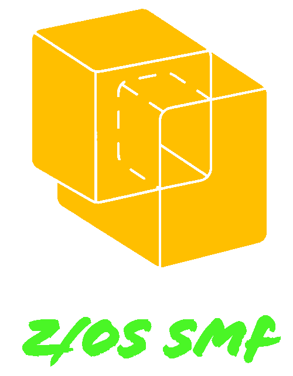

<a id="readme-top"></a>

[![Contributors][contributors-shield]][contributors-url]
[![Forks][forks-shield]][forks-url]
[![Stargazers][stars-shield]][stars-url]
[![Issues][issues-shield]][issues-url]
[![License][license-shield]][license-url]
[![LinkedIn][linkedin-shield]][linkedin-url]


<!-- PROJECT LOGO -->
<br />
<div align="center">
  <a href="https://zossmfdashboard.eu.pythonanywhere.com">
    
  </a>

  <h3 align="center">z/OS SMF Dashboard</h3>

  <p align="center">
    Give your SMF data the most cost effective value!
    <br />
    <a href="https://github.com/franfcwong/zos-smf-dashboard"><strong>Explore the docs »</strong></a>
    <br />
    <br />
    <a href="#demo">View Demo</a>
    ·
    <a href="https://github.com/franfcwong/zos-smf-dashboard/issues/new?labels=bug&template=bug-report---.md">Report Bug</a>
    ·
    <a href="https://github.com/franfcwong/zos-smf-dashboard/issues/new?labels=enhancement&template=feature-request---.md">Request Feature</a>
  </p>
</div>


<!-- TABLE OF CONTENTS -->
<details>
  <summary>Table of Contents</summary>
  <ol>
    <li>
      <a href="#about-the-project">About The Project</a>
      <ul>
        <li><a href="#built-with">Built With</a></li>
      </ul>
    </li>
    <li>
      <a href="#getting-started">Getting Started</a>
      <ul>
        <li><a href="#prerequisites">Prerequisites</a></li>
        <li><a href="#installation">Installation</a></li>
      </ul>
    </li>
    <li><a href="#usage">Usage</a></li>
    <li><a href="#roadmap">Roadmap</a></li>
    <li><a href="#contributing">Contributing</a></li>
    <li><a href="#bonus-track">Bonus Track</a></li>
    <li><a href="#contact">Contact</a></li>
    <li><a href="#acknowledgments">Acknowledgments</a></li>
  </ol>
</details>


<!-- ABOUT THE PROJECT -->
## About The Project

SMF data is a valuable asset in performance monitoring and tuning for every mainframe site. In the recent years, it becomes a hot area in applying data-mining, data analytic, machine learning and AI technologies. However, they are all very pricy in whatever ways so I created this open source one. I want to create a solution so amazing that it'll be the most cost effecitve one you ever have -- I think this is it.

Here's why:
* You should have choice to decide what data is valuable to you and how and where to store them and use them
* Your valuable data shouldn't become incompatible if z/OS version is changed or service provider is changed
* Understanding and interpreting SMF data become easier if it becomes JSON format

Of course, no single solution will fit all mainframe sites since your needs may be different. My project is just to demonstrate that when your SMF data is converted to JSON format, you can do whatever your want. In my project, I store the data in Postgresql DB, analyse and interpret the data using Python only. Due to the data sensitivity, it is hard to show and have huge amount of real data. As a result, I have developed a workload data model to generate JSON data for my testing. The demo shown you is the data generated from the model.  

I will continue adding more features in the near future. You may also suggest changes by forking this repo and creating a pull request or opening an issue. Thanks to all the people have contributed to expanding this project!

The overview of the project is shown below:

![Product Name Screen Shot][product-screenshot]


<p align="right">(<a href="#readme-top">back to top</a>)</p>


### Built With

* [![Python 3.9][Python.io]][Python-url]
* [![Postgres][Postgresql.io]][Postgresql-url]
* [![SQLAlchemy][SQLAlchemy.io]][SQLAlchemy-url]
* [![Dash Mantine Components][DashMantineComponents.io]][DashMantineComponents-url]
* [![Vega Altair][Altair.io]][Altair-url]

<p align="right">(<a href="#readme-top">back to top</a>)</p>


<!-- GETTING STARTED -->
## Getting Started

To get a local copy up and running follow these simple steps. (The z/OS library has been uploaded to CBTTape.org with FILE # 1064. Before the CBT formal release, you can download it from https://www.cbttape.org/ftp/updates/CBT1064.zip.)

### Prerequisites

1. Collect off-time SMF data from mainframe.
   
   This project currently supports SMF "standard" records (30, 70, 71, 72, 73, 74, 75, 77, 78, 110, 123).
   
   _Note: Other SMF records are supported on request; you have to provide some data for testing._ 

* Extract required SMF data from raw SMF data:
  ```sh
  //*
  //* <start-date> and <end-date> format is YYYYDDD or YYDDD
  //*    start date default value is 1900000.
  //*    end date default is 2099366
  //*
  //*  <start-time> format is hhmm
  //*  <end-time> format is hhmm
  //*     start time default is 0000
  //*     end-time default is 2400
  //*     
  //SMFEXTRT EXEC PGM=IFASMFDP
  //DUMPIN   DD   DISP=SHR,DSN=<your-achived-VBS-SMF-file>
  //DUMPOUT  DD   DISP=(NEW,CATLG,DELETE),
  //         DSN=<your-extracted-VBS-SMF-file>,
  //         LRECL=32756,BLKSIZE=32760,RECFM=VBS,
  //         SPACE=(CYL,(500,100),RLSE),
  //         UNIT=DISK,VOL=SER=<your-disk-volume-serial>
  //SYSPRINT DD   SYSOUT=*
  //SYSIN    DD   *
    INDD(DUMPIN,OPTIONS(DUMP))
    OUTDD(DUMPOUT,TYPE(70(1)))
    DATE(<start-date>,<end-date>)
    START(<start-time>) END(<end-time>)
  /*
  ```
* Convert raw SMF data (VBS format) to VB format:
  ```sh
  //*
  //* Using DFSORT to convert VBS to VB
  //*
  //VBS2VB   EXEC PGM=SORT
  //SYSPRINT DD   SYSOUT=*
  //SYSOUT   DD   SYSOUT=*
  //SORTIN   DD   DISP=SHR,DSN=<your-extracted-VBS-SMF-file>
  //OUT1     DD   DISP=(NEW,CATLG,DELETE),
  //         DSN=<your-extracted-VB-SMF-file>,
  //         LRECL=32756,BLKSIZE=32760,RECFM=VB,
  //         UNIT=DISK,VOL=SER=<your-disk-volume-serial>,
  //         SPACE=(CYL,(500,100),RLSE)
  //SYSIN    DD   *
    SORT FIELDS=COPY
    OUTFILE=OUT1
  /*
  ```
* For CICS subtype 1 SMF data, it is required to create dictionary records using CICS-supplied monitoring
dictionary utility program, DFHMNDUP, and then expand CICS subtype 1 SMF data with the following JCL:
  ```sh
  //*
  //* Build performance dictionary record for the CICS region
  //*     
  //DATADICT EXEC PGM=DFHMNDUP,REGION=0M
  //STEPLIB  DD   DISP=SHR,DSN=<your-CICS-SDFHLOAD-library>
  //         DD   DISP=SHR,DSN=<your-lbrary-that-has-MCT-module-used-by-the-CICS-region>
  //SYSUT4   DD   DISP=(NEW,KEEP,DELETE),
  //         DSN=&&MCT,
  //         SPACE=(TRK,(1,5)),UNIT=DISK
  //SYSUDUMP DD   SYSOUT=*
  //SYSOUT   DD   SYSOUT=*
  //SYSPRINT DD   SYSOUT=*
  //SYSIN    DD   *
  MCT=<NO or the suffix of the MCT used in the CICS region>
  SYSID=<your MVS system ID in which CICS region runs>
  GAPPLID=<APPLID in SIT>
  DATE=<yyddd or yyyyddd; default is current date>
  TIME=<hhmmss; default is current time>
  /*
  //*
  //* Expand CICS SMF 110 subtype 1 record
  //*     
  //EXPAND   EXEC PGM=DFH$MOLS,REGION=0M
  //STEPLIB  DD   DISP=SHR,DSN=<your-CICS-SDFHLOAD-library>
  //INPUT    DD   DISP=(OLD,DELETE,DELETE),DSN=&&MCT
  //         DD   DISP=SHR,DSN=<your-compressed-SMF-110-subtype-1-VBS-file>
  //SYSUT2   DD   DISP=(NEW,CATLG,DELETE),
  //         DSN=<your-expanded-SMF-110-subtype-1-VB-file>,
  //         LRECL=32756,BLKSIZE=32760,RECFM=VB,
  //         SPACE=(CYL,(500,100),RLSE),
  //         UNIT=DISK,VOL=SER=<your-disk-volume-serial>
  //SORTWK02 DD   SPACE=(CYL,(50,10)),UNIT=SYSDA
  //SORTWK03 DD   SPACE=(CYL,(50,10)),UNIT=SYSDA
  //SORTWK04 DD   SPACE=(CYL,(50,10)),UNIT=SYSDA
  //SORTWK05 DD   SPACE=(CYL,(50,10)),UNIT=SYSDA
  //SORTDIAG DD   SYSOUT=*
  //SYSUDUMP DD   SYSOUT=*
  //SYSOUT   DD   SYSOUT=*
  //SYSPRINT DD   SYSOUT=*
  //SYSIN    DD   *
    OPTION LOCAL
    EXPAND
  /*
  ``` 
2. Generate JSON files in USS with my purpose-built C programs for each SMF type.
   
    2.1. Create 2 PDSE files, one for C file, one for C header files and both are of LRECL = 256, RECFM = FB. Then, upload the files to the corresponding PDSE files.

    2.2. Compile and linkedit the programs and store the load modules in the load library.
    ```sh
    //*
    //*        Compile and Linkedit job for C program
    //*
    //PROCS    JCLLIB ORDER=(CBC.SCCNPRC)                                   
    //DOCLG    EXEC  PROC=EDCQCB,                                           
    //         INFILE='<your C program source library(member)>',            
    //         OUTFILE='<your program loadlib(member)>,DISP=SHR',
    //         CPARM='OPTFILE(DD:OPTIONS)'                   
    //OPTIONS  DD  *
      LONGNAME FLOAT(HEX)
      LANGLVL(EXTENDED) sscom dll
      DEFINE(_ALL_SOURCE)
      SEARCH(//'<your C header file library>')
    /*
    //COMPILE.SYSLIN DD DISP=SHR,DSN=<your object lib(member)>
    //BIND.SYSLIB  DD DISP=SHR,DSN=CEE.SCEEBND2
    //             DD DISP=SHR,DSN=<your object lib(member)>
    //BIND.SYSLIN  DD DSN=CEE.SCEELIB(CELQS003),DISP=SHR
    //BIND.SYSIN   DD *
      ENTRY CELQSTRT
      INCLUDE SYSLIB(<member>)
      NAME <member>(R)
    //
    ```

    2.3. Run the load module to convert the VB SMF file to JSON.

    ```sh
    //*
    //* Convert VB SMF file to JSON file
    //*
    //SMF2JSON EXEC PGM=<conversion-progam-name>,REGION=0M
    //STEPLIB  DD   DISP=SHR,DSN=CEE.SCEERUN
    //         DD   DISP=SHR,DSN=CEE.SCEERUN2
    //         DD   DISP=SHR,DSN=<your program loadlib>
    //SYSPRINT DD   SYSOUT=*
    //SYSOUT   DD   SYSOUT=*
    //SYSERR   DD   SYSOUT=*
    //CEEDUMP  DD   SYSOUT=*
    //SMFIN    DD   DISP=SHR,DSN=<your-extracted-VB-SMF-file>
    //JSOUT    DD   PATHOPTS=(OWEONLY,OCREAT,OTRUNC),
    //         PATHMODE=(SIRWXU,SIRWXG),
    //         PATN=<path-and-your-JSON-file>
    ```
2. Ftp JSON files from mainframe USS, i.e. path-and-your-JSON-file to the target platform.

3. Run my loading DB Python program for each SMF type to upload the data to Postgresql DB. 

    _Note: Please contact me by mail if you have interest on this DB loading programs._


<p align="right">(<a href="#readme-top">back to top</a>)</p>

### Installation

_Note: Please contact me by mail if you have interest on this app to get a copy of it._

1. To install the packages required in this project, run the following command with requriements.txt provided:
   ```sh
   pip install -r requirements.txt
   ```

2. Unzip the files.
   
3. Modify the file credential.py to adjust to your environment.
   
4. Run the app
   ```sh
   python app.py
   ```

<p align="right">(<a href="#readme-top">back to top</a>)</p>


<!-- USAGE EXAMPLES -->
## Usage
The following table is a reference of the corresponding function in the app:

  | Type  | Subtype | Support Functions                     |
  | :---: | :---: | :--- |
  |  30   |1,2,3,4,5,6| Address Space Activity, Address Space CPU Activity |
  |  70   |    1    | CPU Activity, MSU Analysis     |
  |       |    2    | Cryptographic Hardware Activity |
  |  71   |    1    | Paging Activity                 |
  |  72   |    3    | Workload Activity               |
  |       |    4    | Storage Data                    |
  |       |    5    | Serialization Delay             |
  |  73   |    1    | Channel Path Activity           |
  |  74   |    1    | Device Activity                 |
  |       |    2    | XCF Activity                    |
  |       |    3    | OMVS Kernel Activity            |
  |       |    4    | Coupling Facility Activity      |
  |       |    5    | Cache Subsystem Device Activity |
  |       |    6    | HFS Statistics                  |
  |       |    7    | FICON Director Statistics       |
  |       |    8    | Enterprise Disk System Statistics |
  |       |    9    | PCI Express Based Function Activity |
  |       |   10    | Storage Class Memory Statistics |
  |  75   |    1    | Page Data Set Activity |
  |  77   |    1    | Enqueue activity |
  |  78   |    2    | Virtual Storage Activity |
  |       |    3    | I/O Queuing & HyperPAV Activity |
  | 110   |    1    | Transactions Overview, Wait Analysis |
  |       |    2    | System Overview, CICS Storage, ENQ manager Stat Summary |
  | 123   |    1    | z/OS Connect EE CICS Transactions Overview, z/OS Connect EE Requests Overview |    

<a id="demo"></a>
The following is the video clip of how to use the app:

![Alt Text][product-screenshot-gif]

<p align="right">(<a href="#readme-top">back to top</a>)</p>


<!-- ROADMAP -->
## Roadmap

- [ ] Add Graphical presentations for useful RMF data e.g. Performance Index, % CPU Utilization and % Total Physical CPU Utilization  
- [ ] Support more useful SMF types
- [ ] Enhance user interface of the app
- [ ] Enhance data generation simulator
- [ ] Add support for z/OS version 3.1 or higher and CICS versions higher than 5.5 
- [ ] Improve database performance of the app
- [ ] Selectively extract CICS statistics SMF records 110-2 for those target STIDs from raw data 
- [ ] Support real time SMF data
- [ ] Suppress CICS applications generating SMF records 110-2 by STIDs in real time 

See the [open issues](https://github.com/franfcowng/zos-smf-dashboard/issues) for a full list of proposed features (and known issues).

<p align="right">(<a href="#readme-top">back to top</a>)</p>


<!-- CONTRIBUTING -->
## Contributing

Any contributions and suggestions you would make this better are **greatly appreciated**.

Don't forget to give the project a star if you like this project! ⭐️ It helps others discover the project and
let the revolution to continue and keep the project growing and thriving. Thank you!


<p align="right">(<a href="#readme-top">back to top</a>)</p>


<!-- BONUSTRACK -->
## Bonus Track

<a> Bloods, Sweat and Tears (血淚史):</a>

This project is by no means an easy task especially when you are the only member in your team. Different SMF types have different record structures. So, countless days and nights had been spent in diving into IBM and Broadcom websites, watching YouTube for related materials and taking free online courses such as data science, Python, linear algebra, R, how to build an Python app etc.. SMF type 30, 70-78, 99, 110 and 123 for z/OS version 2.4 and CICS version 5.5 have been chosen for the first phase of the project.

At the beginning of the project, I had painfully paid IBM for a personal zDT license for two years. Within those two years, I developed a C program to transform the raw SMF data to JSON files so as for subsequent database model development. I used SQLite first and migrated to PostgreSQL later because SQLite is not a formal relational database engine. Tons and tons of midnight oil had been burnt in Python programs coding, testing and reconciling the reports with the RMF ones. A browser-based Python app was finally developed to present the SMF data in the database.

As the zDT Learner's edition offer I have been long waiting for did not happen and real SMF data is unlikely to get hold of, building a model that can simulate the real world workload and then generate SMF data json files became my only option. Although there is still a lot of room for improvement in my model, I can still continue the app development using my model at least. 

<p align="right">(<a href="#readme-top">back to top</a>)</p>


<!-- CONTACT -->
## Contact

Fran Wong - franfcwong@hotmail.com


<!-- ACKNOWLEDGMENTS -->
## Acknowledgments

* [Dash Mantine Components](https://dash-mantine-components.com)
* [Othneil Drew's Best README Template](https://github.com/othneildrew/Best-README-Template)
* [Img Shields](https://shields.io)
* [GitHub Pages](https://pages.github.com)
* [IBM Documentation](https://ibm.com)
* [SMF Explorer](https://ibm.github.io/IBM-SMF-Explorer/)
* [Fraud Detection Handbook](https://github.com/Fraud-Detection-Handbook/fraud-detection-handbook)
* [Broadcom MICS Data Dictionary](https://techdocs.broadcom.com/us/en/ca-mainframe-software/traditional-management/ca-mics-data-dictionary/14-5.html)
* [EPS Papers and Presentations](https://www.pivotor.com/content.html)
* [Prof. Gilbert Strang's Linear Algebra Video Lectures](https://ocw.mit.edu/courses/18-06-linear-algebra-spring-2010/video_galleries/video-lectures/)
* [Forecasting: Principles and Practice (3rd ed)](https://otexts.com/fpp3/index.html)

<p align="right">(<a href="#readme-top">back to top</a>)</p>


<!-- MARKDOWN LINKS & IMAGES -->
<!-- https://www.markdownguide.org/basic-syntax/#reference-style-links -->
[contributors-shield]: https://img.shields.io/github/contributors/franfcwong/zos-smf-dashboard.svg?style=for-the-badge
[contributors-url]: https://github.com/franfcwong/zos-smf-dashboard/graphs/contributors
[forks-shield]: https://img.shields.io/github/forks/franfcwong/zos-smf-dashboard.svg?style=for-the-badge
[forks-url]: https://github.com/franfcwong/zos-smf-dashboard/network/members
[stars-shield]: https://img.shields.io/github/stars/franfcwong/zos-smf-dashboard.svg?style=for-the-badge
[stars-url]: https://github.com/franfcwong/zos-smf-dashboard/stargazers
[issues-shield]: https://img.shields.io/github/issues/franfcwong/zos-smf-dashboard.svg?style=for-the-badge
[issues-url]: https://github.com/franfcwong/zos-smf-dashboard/issues
[unused-license-shield]: https://img.shields.io/badge/license-GPLv3-orange.svg?style=for-the-badge
[license-shield]: https://img.shields.io/github/license/franfcwong/zos-smf-dashboard.svg?style=for-the-badge
[license-url]: https://github.com/franfcwong/zos-smf-dashboard/blob/main/LICENSE
[linkedin-shield]: https://img.shields.io/badge/-LinkedIn-black.svg?style=for-the-badge&logo=linkedin&colorB=555
[linkedin-url]: https://linkedin.com/in/francis-wong-b9123020
[product-screenshot]: images/smf-to-dashboard.png
[product-screenshot-gif]: images/screen4a.gif
[Python.io]: https://img.shields.io/badge/Python-3776AB?style=flat&logo=python&logoColor=white
[Python-url]: https://www.python.org/
[Postgresql.io]: https://img.shields.io/badge/Postgres-%23316192.svg?logo=postgresql&logoColor=white
[Postgresql-url]: https://postgresql.org/
[SQLAlchemy.io]: https://img.shields.io/badge/SQLAlchemy-black?style=flat&logo=SQLAlchemy&logoColor=D71F00
[SQLAlchemy-url]: https://sqlalchemy.org/
[DashMantineComponents.io]: https://img.shields.io/badge/Dash%20Mantine%20Components-%230769AD
[DashMantineComponents-url]: https://dash-mantine-components.com/
[Altair.io]: https://img.shields.io/badge/Vega%20Altair-black
[Altair-url]: https://altair-viz.github.io/
